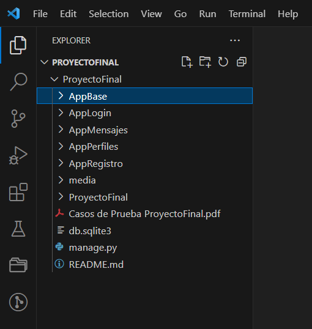

Proyecto Final Quevedo, Sandra Curso Python Comisión 47765 Coderhouse

ProyectoFinal es una aplicación web desarrollada en Django que permite a los usuarios registrarse y crear, ver, editar y eliminar películas. Permite realizar reseñas y ordenarlas las películas por fecha de lanzamiento y valoración. Incluye un foro de discusión entre usuarios registrados, mensajes entre ellos y la busqueda de películas según determinados criterios. La lógica aplicada a la  autenticación y autorización restringe el acceso a ciertas funciones a usuarios no registrados. Permite la edición de perfil y manejo de los avatars, como también un apartado de admin donde se puede administrar toda la web.

# Estructura:

# Funcionalidades:

1. Registro y Autenticación: Los usuarios pueden... 
        * registrarse clickeando en "CREAR USUARIO".
        * iniciar sesión en "LOGIN".
        * cerrar sesión de la aplicación en cualquier momento en "LOGOUT".

        superusuario (django)
        usuario: queve
        email: quevedo.sandra@gmail.com
        clave: tincho07

        superusuario2 (django)
        usuario: pepino
        email: pepino@python.com
        clave: 2512

2. Lista de Películas: Los usuarios pueden agregar películas clickeando en "AGREGAR". Una vez agregada pueden "EDITAR" y "ELIMINAR". Además la app permite agregar reseñas sobre las películas listadas clickeando en "AGREGAR RESEÑA" y una vez agregada es posible "EDITAR" y "ELIMINAR". Los usuarios pueden ordenar películas guardadas por "FECHA DE LANZAMIENTO" y "VALORACION".

3. Búsqueda de Películas: Los usuarios pueden buscar películas guardadas por "NOMBRE", "GENERO", "EMPRESA" y "VALORACIÓN" clickeando en los botones correspondientes. 

4. Foro: Los usuarios pueden acceder a una lista de todos los temas de discusión existentes en el foro. Esto es, acceder a ver detalles de un tema de discusión específico clickeando en el tema. Los usuarios pueden crear un nuevo tema de discusión clickeando en "CREAR NUEVO TEMA". Los usuarios pueden editar un tema de discusión existente clickeando en "EDITAR". Los usuarios pueden eliminar un tema de discusión existente clickeando en "ELIMINAR". Los usuarios pueden comentar un tema de discusión existente clickeando en el tema y después "AGREGAR".

5. Mensajes: Los usuarios pueden acceder a una lista de todos las conversaciones clickeando en "MENSAJES" arriba o bajando en la parte del chat. Cada uno tiene su propia mensajería privada con los mensajes que envió a cada usuario. Los usuarios pueden crear una nueva conversación con un mensaje hacia otro usuario clickeando en "CREAR NUEVA CONVERSACIÓN". Los usuarios pueden dejar un comentario respondiendo el mensaje que otro usuario les envió clickeando en "VER CONVERSACIÓN" y luego "ENVIAR MENSAJE", luego se podrá visualizar la conversación actualizada en "MENSAJES".

6. Perfil: Los usuarios pueden editar su perfil clickeando en "PERFIL" y luego "EDITAR PERFIL". Se les permite agregar un avatar para su perfil clickeando en "PERFIL" y luego "AGREGAR AVATAR". Los usuarios pueden visualizar los avatares que tiene clickeando en "PERFIL" y luego "VER AVATARES".

7. Administración: Los usuarios con permisos de Administrador pueden ver, editar, eliminar y agregar todo.

8. AboutMe: Descripción y curiosidades sobre el creador de la web.

# Requerimientos: 

Antes de poder utilizar ProyectoFinal, debe tener instalado lo siguiente: Python 3.8 o superior Django 3.4 o superior

# Instalación:

Para instalar ProyectoFinal, seguir los siguientes pasos:

a. Clonar el repositorio de ProyectoFinal en su máquina local utilizando el siguiente comando: git clone https://github.com/your_username/ProyectoFinal.git
b. Navegar hasta el directorio ProyectoFinal utilizando el comando cd ProyectoFinal.
c. Instalar los paquetes necesarios utilizando el comando pip install -r requirements.txt.
d. Configurar la base de datos utilizando el comando python manage.py migrate.
e. Ejecutar la aplicación utilizando el comando python manage.py runserver.

# Casos de Prueba:

Los casos testeados se encuentran en Casos de Prueba ProyectoFinal.pdf

